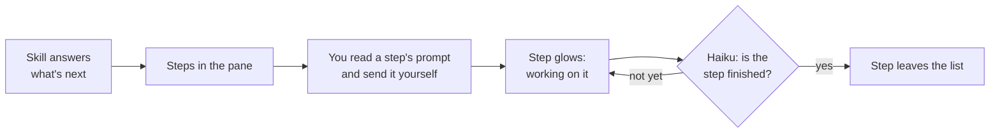

# 🧩 claude-mods

> Small TypeScript mods that live inside Claude Code: a pane that knows your next step, one-click replies, a rate-limit countdown that resumes for you, your repo's pull requests and issues beside the conversation, a shelf of paths you use every day, a chime when a long turn ends, a guard for the Office file you left open, a list of the files this session made, a list of the ones it read, and one dialog for every mod's settings.


claude-mods is one developer's personal toolbox of Claude Code mods, shared as a plugin marketplace so anyone can install them.
The mods are built for the author's own workflow first, and you are a welcome guest: install one, install all eleven, or read the source and write your own.

## What is a mod?

A mod is a plugin of function hooks: TypeScript that runs inside Claude Code and changes what it shows (a pane in the side panel, a band of buttons above the prompt, the status line) or what it does between turns.
The mod's own code decides when to act, even when what it does is send the model a prompt.

| | Runs as | Who decides when it acts |
| --- | --- | --- |
| **Mod** | TypeScript function hooks inside Claude Code | The mod's own code |
| **Skill** | Instructions the model reads | The model |
| **Plain plugin** | Commands, agents or shell hooks | You, or a shell script |

## The mods

| Mod | Where it shows | What it does |
| --- | --- | --- |
| 🧭 [whats-next](#-whats-next) | Pane in the side panel | Lists the next steps of your workflow, each with a prompt ready to paste |
| ⚡ [quick-reply](#-quick-reply) | Band above the prompt | One-click replies, including the options Claude just offered and the next wayfinder ticket |
| ⏳ [auto-resume](#-auto-resume) | Band and status line | Counts down to a rate limit's reset, then sends "continue" |
| 🐙 [github-panel](#-github-panel) | Pane in the side panel | The repo's open pull requests and issues, one click from the browser; a toast when your branch's checks turn green or red |
| 📚 [shelf](#-shelf) | Band above the prompt | Named folders and files; one click drops a path into what you are typing |
| 🔔 [turn-chime](#-turn-chime) | Sound and toast | Tells you when a long turn ends or Claude stops to ask you something |
| 🔒 [open-file-guard](#-open-file-guard) | Question dialog | Asks you to close a Word, Excel or PowerPoint file before Claude uses it |
| 📂 [outputs](#-outputs) | Pane in the side panel | The files this session made or changed, newest first; click one to open it |
| 🔎 [sources](#-sources) | Pane in the side panel | The files Claude read, grouped by where they came from, with a lock to the project folder |
| 📊 [hud](#-hud) | Two lines under the prompt | Model, effort, context window, rate limits, turn timer, tool calls, agents, git state, worktree, cost, session length and folder, each named and in colour |
| ⚙ [mod-settings](#-mod-settings) | Gear on each pane; a dialog | Change and save any mod's settings without leaving the session |

When more than one mod has a pane open, Claude Code shows them as tabs in the side panel.

### 🧭 whats-next

A pane listing the next steps of your workflow for the project folder, kept between sessions.
A skill of your choosing answers "what's next" in a headless run beside your session, and the mod turns the answer into steps.

```text
What's next                        refresh
updated 3 min ago

Fix the failing parse test
working on it  done
The check is red, so nothing else can merge.

Open a pull request for the fix
Review comes before the next feature starts.

Triage the two new issues
They arrived while you were heads-down.
```



- **You stay in charge.** A step's prompt reaches the model only when you read it and send it yourself. Click a step to see its prompt, then paste it, paste it into a fresh session, or copy it.
- **It notices when you are done.** After each answered turn, Haiku is asked whether the step is finished, and a finished step leaves the list. Press `d` to drop it yourself.
- **The run that asks is read-only.** By default it gets only read commands of git and gh plus Read, Glob and Grep. `git push`, `git config`, `git -c`, `gh api` and `--output` are always denied.

| Command or key | What it does |
| --- | --- |
| `/whats-next` | Bring the pane to the front |
| `/whats-next refresh` | Ask the skill again |
| `r` | Refresh |
| `1` to `9` | Show that step's prompt in the pane |
| `p`, `n`, `c` | Paste the shown prompt, paste it after `/clear`, or copy it |
| `b` | Back to the list |
| `d` | Mark the active step done |

| Setting | Key | Default | Meaning |
| --- | --- | --- | --- |
| Skill | `skill` | `/ask-sean` | The skill that answers "what's next", written as you would run it: `/` followed by letters, digits, `_`, `:`, `.` or `-` |
| Most steps | `maxSteps` | `5` | How many steps to ask for (1-9) |
| Refresh on start | `refreshOnStart` | on | Ask for a fresh list when a session starts in a git repository |
| Tools the headless run may use | `allowedTools` | empty: the read-only set | Comma-separated permission rules for the headless run |
| Model | `model` | empty: your default | Model for the headless run, as an alias (`haiku`) or a full id |

`/ask-sean` is the author's own skill, so point the Skill setting at a skill of yours that answers "what should I do next?" ([how to set it](#configure-the-mods)):

```sh
echo '{"skill": "/next-steps", "maxSteps": "3", "model": "haiku"}' | claude plugin configure whats-next@claude-mods --values-stdin
```

The read-only set, used while Tools is empty, is `Bash(git status:*)`, `Bash(git log:*)`, `Bash(git diff:*)`, `Bash(git show:*)`, `Bash(git rev-parse:*)`, `Bash(git branch --show-current)`, `Bash(git branch -vv)`, `Bash(git remote -v)`, `Bash(gh issue list:*)`, `Bash(gh issue view:*)`, `Bash(gh pr list:*)`, `Bash(gh pr view:*)`, `Bash(gh pr checks:*)`, `Bash(gh run list:*)`, `Read`, `Glob` and `Grep`.

- A list you write replaces that set; it does not add to it. To widen the set, write all of it plus your additions.
- Each rule is a tool name, optionally followed by `(...)`. One rule that is not, such as one starting with `-`, discards your whole list and the read-only set is used.
- The run can always call `Skill`, so a skill that calls another still works. MCP servers load only when a rule names an `mcp__` tool.

**Needs:** the `claude` CLI on the PATH, and the skill named in the Skill setting.

### ⚡ quick-reply

One row of buttons above the prompt after each answer.
When Claude ends on a question, the band offers the choices Claude asked you to pick from, then your replies to a question. After any other answer it offers your other replies. You set both lists in the settings below.

```text
Reply:  [a: Keep the copies]  [b: Add a sync script]  [Yes]  [Go with your recommendation]  [No]
```

- A choice's button sends its marker with its label, so the model cannot misread it.
- A numbered report before a yes-or-no question ("Shall I commit?") is not offered as choices.
- When the answer recommends something, the "recommend" reply is the highlighted one. Advice against something does not count.
- The band stays out of the way while Claude is working, and after a subagent's turn.

**Next ticket.** When you work a map with the `wayfinder` skill, the band leads with the next ticket after each turn that closes one or charts the map:

```text
Reply:  [Next ticket: /wayfinder 135]  [Continue]  [Commit and push]
```

One press runs `/clear` and then `/wayfinder 135`, the loop you would otherwise type.
It is offered only in a session that ran the `wayfinder` skill, after a turn whose `gh issue close` worked; after charting it names the map the turn created.
A close made some other way (`gh api`, the web) is not seen, so no button shows, and once a turn closes the map itself the loop ends.

| Setting | Key | Default | Meaning |
| --- | --- | --- | --- |
| Replies to a question | `questionReplies` | `Yes\|Go with your recommendation\|No` | Shown after Claude asks something, separated by `\|`; empty shows only the choices Claude offered |
| Replies otherwise | `idleReplies` | `Continue\|Commit and push` | Shown after any other answer; empty hides the band then, except for Next ticket |
| Offer the next wayfinder ticket | `wayfinderNext` | `true` | After a wayfinder turn closes a ticket or charts a map, offer Next ticket |

Each list holds up to six replies. A reply longer than 120 characters is cut short, and a repeat is dropped.
For example, to answer questions with your own three replies and hide the band after other answers ([how to set it](#configure-the-mods)):

```sh
echo '{"questionReplies": "Yes|No|Explain that first", "idleReplies": ""}' | claude plugin configure quick-reply@claude-mods --values-stdin
```

### ⏳ auto-resume

When a turn dies on a rate limit or an overloaded API, auto-resume counts down to the reset and sends "continue" for you.
Go to lunch, and come back to finished work.

```text
⏳ rate limited:  sending "continue" in 1 h 12 min  [Resume now]  [Cancel]
```

- The countdown shows above the prompt and in the status line.
- Send a prompt of your own and it steps aside: you took over.
- It gives up after too many resumes in a row without a successful answer.

| Command | What it does |
| --- | --- |
| `/auto-resume` | Say what is waiting, if anything |
| `/auto-resume now` | Send the resume now |
| `/auto-resume cancel` | Cancel the wait |
| `/auto-resume in <minutes>` | Schedule a resume yourself (1 to 1440) |

| Setting | Key | Default | Meaning |
| --- | --- | --- | --- |
| Resume prompt | `text` | `continue` | What is sent when the wait is over; empty sends `continue` |
| Grace after reset (s) | `graceSeconds` | `60` | Extra seconds to wait past the limit's reset time (0-900) |
| Retry overloaded/server errors | `retryOverloaded` | on | Also resume after an overloaded or server error, backing off from one minute |
| Most retries in a row | `maxRetries` | `5` | Give up after this many resumes without a successful answer (1-20) |

For example, to send a longer prompt and wait two minutes past the reset ([how to set it](#configure-the-mods)):

```sh
echo '{"text": "continue where you left off", "graceSeconds": "120"}' | claude plugin configure auto-resume@claude-mods --values-stdin
```

### 🐙 github-panel

A GitHub pane beside What's next listing the repo's open pull requests and issues.
Click one to open it in the browser.

```text
octocat/hello-world                refresh
updated just now

Pull requests 2                        all
#41 Add a drift check for copied guards
  draft · @octocat
#40 Bring the asked pane to the front
  ✗ checks failing · @hubot           fix

Issues 2                               all
#39 Share the headless-session check
  blocked by #12 · ready-for-agent · @octocat
#12 Decide how shared code is copied
  needs-triage · @hubot
```

- An issue blocked by an open issue has a red line under it. Hover it to see what blocks it.
- The lists refresh on a timer, after a turn once they are a minute old, and on `r`.
- The pull request of the branch you are on is watched: when its checks turn green or red, a toast says "Checks passed on #40" or "Checks failed on #40".
  The first refresh, and the first after you switch branch, only notes where the checks stand.
- While that pull request's checks fail, its row has a `fix` button.
  It fills the prompt box with the failed checks' names, the last 40 lines of the failed run's log, and "Fix it."
  Nothing is sent: you read it and send it yourself.
  The log is fetched only when you press `fix`; when gh cannot fetch it, such as while the run is still going, the prompt holds the names alone.

| Command or key | What it does |
| --- | --- |
| `/github` | Bring the pane to the front and refresh it |
| `r` | Refresh |
| `all` | Open the whole list on GitHub |
| `fix` | Fill a request to fix the current branch's failing checks into the prompt box |

| Setting | Key | Default | Meaning |
| --- | --- | --- | --- |
| Most items per list | `limit` | `30` | How many open pull requests and issues to list each (1-100) |
| Refresh every (minutes) | `refreshMinutes` | `5` | How often to refresh (0-120); `0` refreshes only on open, after turns and on `r` |

For example, to list fifty of each and stop the timer ([how to set it](#configure-the-mods)):

```sh
echo '{"limit": "50", "refreshMinutes": "0"}' | claude plugin configure github-panel@claude-mods --values-stdin
```

**Needs:** the [GitHub CLI](https://cli.github.com), logged in, and a folder with a GitHub remote.

### 📚 shelf

A row of named folders and files above the prompt, for the paths you type again and again.
Click a name and its path lands at the cursor in what you are typing. Nothing is sent.

```text
Shelf:  [brand]  [records]  [kb]
```

- A path with a space arrives in double quotes, ready to use.
- The shelf is the same in every project folder and every session.
- When the names do not fit one row, the band shows those that do and counts the rest; `/shelf` always lists them all.

| Command | What it does |
| --- | --- |
| `/shelf` | List the shelf with each path |
| `/shelf add <name> [path]` | Put a path on the shelf; with no path, the project folder |
| `/shelf remove <name>` | Take one off |

The shelf has no settings: you fill it with `/shelf add`.

```text
/shelf add brand "N:/Marketing/Brand Kit"
/shelf add records N:/RECORDS
/shelf add kb
/shelf remove brand
```

- A name is one word of up to 24 characters. Adding a name already on the shelf, whatever its capitals, replaces that entry where it stands.
- The path is kept exactly as you type it, so give a full path. Quote a path that has a space.
- With no path, the shelf keeps the project folder you are in, as a full path.

### 🔔 turn-chime

A short sound and a toast when Claude has finished something you have been waiting on.
Start a long job, look away, and hear when it is done.

```text
Turn finished after 4m 12s.
```

- It chimes when a turn that ran three minutes or more ends.
- It chimes when Claude finishes three minutes or more after your last prompt, since work left running in the background reports in a short turn of its own.
- It chimes once when Claude stops to ask you something that far in.
- A turn you stopped yourself stays silent, and so does a subagent's turn.

| Setting | Key | Default | Meaning |
| --- | --- | --- | --- |
| Long turn (minutes) | `thresholdMinutes` | `3` | How long counts as long; any number above 0, so `0.5` is thirty seconds |

For example, to chime only after ten minutes ([how to set it](#configure-the-mods)):

```sh
echo '{"thresholdMinutes": "10"}' | claude plugin configure turn-chime@claude-mods --values-stdin
```

The sound plays on macOS and Windows. A Linux terminal has no player, so only the toast shows there.

### 🔒 open-file-guard

When Claude is about to use a Word, Excel or PowerPoint file that you have open, the mod asks you to close it before the call runs, instead of letting the write fail.

```text
"Audit Summary.pptx" is open in PowerPoint, and Claude is about to use it.
Close it so a write to it can go through?

  I closed it
  Go ahead anyway
```

- **I closed it**: the mod checks again and the call goes on. Still open, it asks again, three times at most.
- **Go ahead anyway**: the call goes on, and that file is not asked about again in the turn. This is for a command that only reads the file.
- **Dismissed**: the call is refused, and Claude is told which file to ask you to close.

It sees a file named in a Write or Edit call or in the text of a shell command.
It does not see one a script works out as it runs, nor one on a network location.

There is nothing to set: once installed, it guards every session.

### 📂 outputs

A pane listing the files this session has made or changed in the project folder, newest first.
Click one to open it with its own application, so "where did that file go?" needs no prompt.

```text
Outputs                            refresh
Audit Summary.pptx
  reports · just now          copy path
EG 2026 Review.docx
  2 min ago                   copy path

3 other files (show)
```

- Documents come first: Word, Excel, PowerPoint, PDF, Markdown, HTML and text files. Scripts, images and data fold under one "other files" line.
- The list refreshes after each tool call that can write, when a turn ends, and on `r`.
- Hidden folders, `node_modules` and Office's lock files are passed over. A very large folder is looked through only in part, and the pane says so.

| Command or key | What it does |
| --- | --- |
| `/outputs` | Bring the pane to the front and list afresh |
| `r` | Refresh |
| `c` | Copy the newest document's path |
| `o` | Show or hide the other files |

There is nothing to set: the pane lists what the session made, with no list to keep.

### 🔎 sources

A pane listing the files Claude has read this session, grouped by where they came from, so you can see what an answer drew on.
A lock keeps reads inside the project folder when that folder is meant to be the only source of truth.

```text
Reads: anywhere                       lock

This folder  4
  Corporate Docs/standard.pdf
  program.docx

N:/RECORDS/Permits  2
  2026/permit.pdf
```

- With the lock on, a Read, Grep or Glob outside the project folder is refused, and Claude is told why and how you can allow the folder.
- The lock judges a path by where it leads: `..` is followed, and so is a link to another folder. A Glob pattern or a Grep `glob` is judged by the folder it starts from, and refused when a `..` comes after a wildcard. A path from the home folder (`~/notes.md`) is refused, and so is one like `D:notes.md` that leans on another drive's current folder.
- The lock and the allowed folders last for the session. A new session starts unlocked.
- The lock covers the three read tools only. A shell command can still read anywhere.

| Command or key | What it does |
| --- | --- |
| `/sources` | Bring the pane to the front |
| `/sources allow <path>` | Let reads into that folder while the lock is on |
| `/sources allow` | List the allowed folders |
| `l` | Turn the lock on or off |

There are no settings to keep: the lock and the allowed folders are set in each session, from the pane and with `/sources allow`.

```text
/sources
/sources allow N:/RECORDS/Permits
```

Press `l` in the pane to turn the lock on.

### 📊 hud

Two coloured lines under the prompt with the figures you keep checking, each one named, so you never have to ask for them.

```text
model fable 5.1  effort high  context ███░░░░░ 42%  5h limit 31% · resets in 2h 5m
turn 3m 12s  tools 4 this turn · 19 total  agents 2 running  git main · 3 changed · 1 ahead  🪾 worktree claude-mods-121  cost $1.24  session 1h 12m  folder claude-mods-121
```

- **First line, the model:** which model, how hard it is asked to think, the context window as a gauge, and each rate-limit window with the time to its reset.
- **Second line, the work:** a timer for the running turn, tool calls this turn and in all, running subagents, the git branch with changed files and commits ahead and behind, the worktree's folder (the main checkout's or a linked one's), the session's cost and length, and the folder.
- **Colour means something.** The context gauge turns yellow at 70% and red at 85%; a rate limit turns yellow at 75% and red at 90%.
- **A rate limit in the red is announced.** When one reaches 90%, a toast names it and, when Claude Code reports it, says when it resets. It comes once in each window, so you hear of it without looking at the line.
- **It moves only when there is something to watch.** While a turn runs, the theme's colours travel along the lines and a figure in the red blinks. Idle, they are still.
- **It fits.** On a narrow terminal whole figures are left out of each line, the least important first, and the context window goes last.
- A figure with nothing to show is absent: no git state or worktree outside a repository, no agents when none run, no effort until the first request has gone out.

| Setting | Key | Default | Meaning |
| --- | --- | --- | --- |
| Colour theme | `theme` | `neon` | `neon`, `ocean`, `ember` or `mono` |
| Animate while working | `animate` | on | Move the colours during a turn and blink a figure in the red |
| Where the row is drawn | `placement` | `below` | `below` the prompt, or `above` it in the band |
| Segments to hide | `hide` | empty: none | Comma-separated, from: model, effort, context, limits, turn, tools, agents, git, worktree, cost, session, folder; any other name is ignored |

For example, a still row in the `ember` colours without the cost and the folder ([how to set it](#configure-the-mods)):

```sh
echo '{"theme": "ember", "animate": "false", "hide": "cost,folder"}' | claude plugin configure hud@claude-mods --values-stdin
```

**Needs:** nothing. Git state shows when `git` is on the PATH and the folder is a repository.

### ⚙ mod-settings

One dialog for the settings of every installed mod: pick a mod, change its settings, save.
Press ⚙ at the top right of a mod's pane, or run `/mod-settings`.

```text
Mod settings                         close
auto-resume  4 settings
github-panel  2 settings
hud  4 settings
quick-reply  2 settings
turn-chime  1 setting
whats-next  5 settings
Mods with no settings are not listed.
```

```text
hud                             back close

Colour theme
The colours the row moves through.
[ neon ] [ ocean ] [ ember ] [ mono ]

Animate while working
Move the colours across the row while ...
[ on ]

Where the row is drawn
Below the prompt, above Claude Code's ...
[ below ] [ above ]

Segments to hide
Comma-separated, from: model, effort, ...
cost,folder

[ Save ]  Saved 2 settings.
```

- The gear shows on the panes of whats-next, github-panel, outputs and sources while mod-settings is installed.
- Mods with no settings are not listed.
- Each setting shows its current value. Change the ones you want and press Save, or Enter in a text field: only the settings you changed are saved, and the mod reloads with them at once.
- A value Claude Code refuses is shown in red under its setting, with what you typed kept so you can fix it. The other settings still save.
- A setting that managed settings own is shown as locked.
- A text or number setting is changed on the terminal, desktop or editor; the phone shows its value.

| Command or key | What it does |
| --- | --- |
| `/mod-settings` | Open the dialog in front |
| ⚙ | Open the dialog from a mod's pane |
| Esc | Close the dialog |

There is nothing to set: the dialog reads every mod's settings from Claude Code.

**Needs:** nothing.

## Quick start

The fastest way is to let Claude do it. Paste this prompt into Claude Code:

```text
Install the Claude Code mods from https://github.com/seanrobertwright/claude-mods.

1. Clone the repository into a folder that will stay where it is: the mods run from that folder.
2. Add it as a plugin marketplace: claude plugin marketplace add <that folder>
3. Install every mod the marketplace lists, each with: claude plugin install <name>@claude-mods
4. Tell me which mods were installed and what each one's command or place on screen is, then remind me to run /reload-plugins.

Change no other setting, and stop and tell me if a step fails.
```

Or do it by hand. This repo is a plugin marketplace (`.claude-plugin/marketplace.json`). Clone it, add it once, then install the mods you want:

```sh
git clone https://github.com/seanrobertwright/claude-mods claude-mods
claude plugin marketplace add ./claude-mods

claude plugin install whats-next@claude-mods
claude plugin install quick-reply@claude-mods
claude plugin install auto-resume@claude-mods
claude plugin install github-panel@claude-mods
claude plugin install shelf@claude-mods
claude plugin install turn-chime@claude-mods
claude plugin install open-file-guard@claude-mods
claude plugin install outputs@claude-mods
claude plugin install sources@claude-mods
claude plugin install hud@claude-mods
claude plugin install mod-settings@claude-mods
```

To try a mod for one session only, with nothing installed:

```sh
claude --plugin-dir mods/quick-reply
```

In the terminal, Claude Code reads an installed mod from this folder, so an edit takes effect at the next session start or after `/reload-plugins`.
Claude Desktop runs a copy kept in Claude Code's plugin cache instead: `claude plugin update` leaves that copy alone while the mod's version is unchanged, so only a reinstall or a version bump brings an edit there.

Every mod works on its defaults. To change them, see [Configure the mods](#configure-the-mods).

## Configure the mods

whats-next, quick-reply, auto-resume, github-panel, turn-chime and hud have settings, listed in each mod's section above with the key each one is stored under.
shelf and sources are set up with their own commands, in the session; outputs and open-file-guard have nothing to set.

A mod is named by its id, `<mod>@claude-mods`. Each way below writes to the same place, so use whichever is to hand.

### In the side panel

With [mod-settings](#-mod-settings) installed, press ⚙ at the top right of a mod's pane, or run `/mod-settings`.
Pick a mod, change its settings and save.
It writes where `/plugin configure` and `/config` write, and the mod reloads with the new values at once.
A refused value is shown in red under its setting.

### In a session

```text
/plugin configure hud@claude-mods
```

This opens a form with the mod's settings. Change the ones you want and save.

### From a terminal

See a mod's settings, and which you have set:

```sh
claude plugin configure hud@claude-mods
```

Set them by piping in a JSON object. Every value is a JSON string, numbers and on or off (`"true"`, `"false"`) included. Settings you leave out keep their values.

```sh
echo '{"theme": "ember", "animate": "false", "hide": "cost,folder"}' | claude plugin configure hud@claude-mods --values-stdin
```

The same line works in bash, zsh and PowerShell. Or set values as you install, one `--config` per setting:

```sh
claude plugin install github-panel@claude-mods --config limit=50 --config refreshMinutes=0
```

A change made from a terminal applies from the next Claude Code session.

### In settings.json

The values live in your user settings, `~/.claude/settings.json`, under `pluginConfigs`. Here numbers and on or off are plain JSON numbers and booleans:

```json
{
  "pluginConfigs": {
    "hud@claude-mods": {
      "options": { "theme": "ember", "animate": false, "hide": "cost,folder" }
    },
    "turn-chime@claude-mods": {
      "options": { "thresholdMinutes": 10 }
    }
  }
}
```

- Delete a key to put that setting back to its default.
- Claude Code reads `pluginConfigs` from your user settings, from managed settings and from a `--settings` file. A project's `.claude/settings.json` is not read, so one value holds in every folder.
- An edit here applies from the next Claude Code session.

### A value that does not fit

- `claude plugin configure` and `--config` refuse a value of the wrong type, and a choice that is not on the list, naming the setting: `Failed to save configuration: Colour theme must be one of: neon, ocean, ember, mono`.
- The settings dialog refuses the same values, with the reason under the setting. Like `claude plugin configure`, it also refuses a text with a line break or over 64 KB. A number setting left blank is refused rather than cleared: delete its key in `settings.json` to put it back to its default.
- A number outside the range in the mod's table, a fraction in any number setting but Grace after reset and Long turn, or a text setting in a shape the mod does not take, is passed over and the mod uses that setting's default. Nothing tells you, so check the table when a change seems to do nothing.

## Good manners, built in

Every mod here follows the same house rules, written down in [`CONTEXT.md`](CONTEXT.md):

- **Quiet when nobody is watching.** In a headless session (`claude -p`, or an SDK session nobody has opened) a mod draws nothing, polls nothing and starts nothing new. Work already set going, such as a resume after a rate limit, still finishes.
- **Says what it needs.** A mod that lacks a requirement, such as a skill, a CLI tool or a logged-in account, names it in its own pane and says how to meet it, instead of failing obscurely.
- **Never grabs the keyboard.** A pane that opens unasked never takes the keyboard. Ask for it with its command and it comes to the front, and Esc hands the keyboard back.
- **Self-contained.** Each mod imports only from its own folder and from `claude-code`, so installing one mod never depends on another ([ADR-0001](docs/adr/0001-self-contained-mods.md)).

## Under the hood

```text
claude-mods/
├── .claude-plugin/marketplace.json   the catalogue Claude Code reads
├── mods/
│   └── <mod>/
│       ├── .claude-plugin/plugin.json   name, version, settings
│       ├── hooks/
│       │   ├── hooks.json               names the module to load
│       │   ├── register.tsx             the hooks and what they draw
│       │   └── parse.ts                 pure logic, kept apart for tests
│       ├── tests/                       run by `claude plugin test`
│       └── types/
├── scripts/check-mods.mjs            the four checks, one mod at a time
└── docs/                             decisions and research
```

A mod is a `register` function that hooks Claude Code's events and draws with its components. This is the heart of quick-reply, trimmed:

```tsx
export const register: Register = (on, options) => {
  on('turn.complete', async ($, e, next) => {
    const done = await next(e)
    await update($, reading, () => (e.reason === 'answer' ? readAnswer(e.answer) : null))
    return done
  })

  on('ui.render', { component: 'AbovePrompt' }, async ($, e, next) => {
    const { Box, Text, Button } = $.ui.resolve(e)
    // ...a row of buttons, each sending its reply as you
  })
}
```

Further reading:

- [`CONTEXT.md`](CONTEXT.md): the project's vocabulary, from mod and pane to headless run.
- [ADR-0001](docs/adr/0001-self-contained-mods.md): why shared code is duplicated instead of imported.
- [ADR-0002](docs/adr/0002-shared-modules-cannot-own-hooks.md): why a shared module cannot own a mod's timer or hooks.
- [Detecting a headless session](docs/research/headless-and-requirements.md): the research behind the quiet-when-headless rule.

## Checks

`npm run check` checks every directory under `mods/`, one mod at a time, in this order:

1. `tsc --noEmit --strict` against the mod's `tsconfig.json`
2. ESLint with `eslint.config.mjs`, where unused imports, unused variables and unreachable code are errors and any warning also fails
3. `claude plugin validate`
4. `claude plugin test`

It stops at the first failure and names the mod and the step.

A mod's `tsconfig.json` extends `.claude-plugin/types/tsconfig.json`, which Claude Code writes when it loads the mod and which git ignores.
When that file is missing, as on a fresh clone, the script loads the mod once with a headless `claude -p` run of a local command, which makes no model call.
The script needs the `claude` CLI on the PATH.

`npm install` wires the pre-commit hook. On each commit it runs:

- the personal-data check over tracked files (`npm run check:secrets` runs it by hand)
- markdownlint on staged Markdown (`npm run lint:md` lints every Markdown file)
- the same four mod checks, only for the mods with staged changes (`node scripts/check-mods.mjs --staged`). They read the files on disk, so unstaged edits in a staged mod are checked too.

`npm run test:scripts` runs the tests for the check script itself.

## Make your own

The fastest way in is to copy the smallest mod, [`mods/quick-reply`](mods/quick-reply), rename it, add it to `.claude-plugin/marketplace.json` and run it with `claude --plugin-dir mods/<name>`.
Claude Code's bundled `plugin-authoring` skill documents the hooks, the components and the load-time checks, and `npm run check` tells you when the mod is ready.
